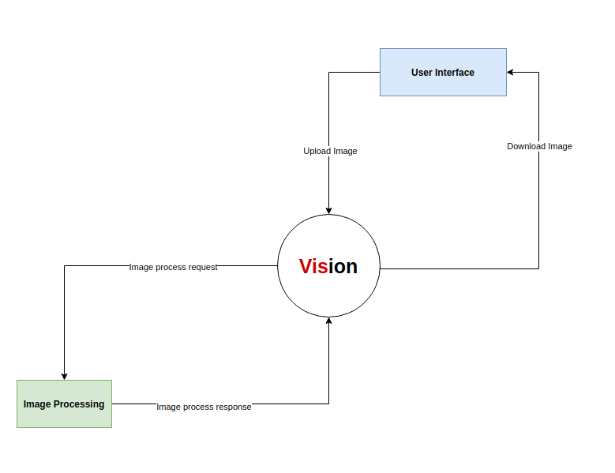
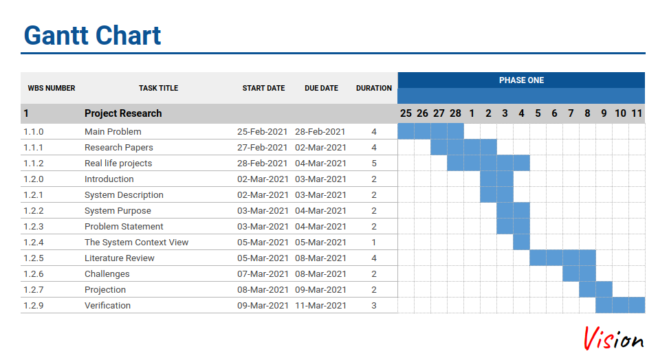
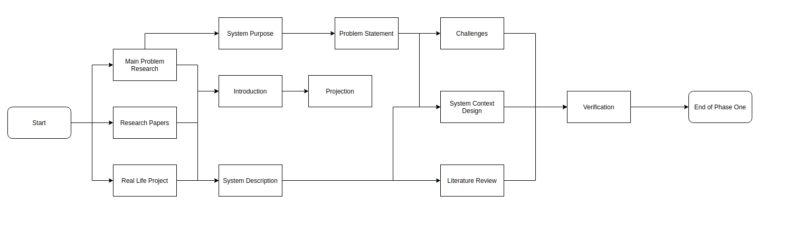

# Vision

# Introduction
Imagine taking an amazing picture, and you get home exited to put that picture on a huge monitor in your living room, so you can show it off to people who come to your house, to find out that when you put a small picture on a big screen, most of the details in the picture are lost, which leads to a blurry picture, that does not look good. Now that happens when you just have fun and take normal pictures, imagine when that picture is important to a crime, or for getting important information, or a memory of someone, you can’t just get back in time to get a better looking picture with higher resolution, the time machine has not been invented yet, and we also can’t just try to guess what that blurry part of the picture is and assume the information we need. We have to solve this problem, which is not limited to only pictures, but videos as well.

That problem is called the Super Resolution problem, SR for short, which is essentially just taking a low resolution picture and converting it to a high resolution picture, with magic of course. It might seem like an easy problem to solve; because of the fact that the requirement are simple, but it’s not easy, it’s simple, but not easy, there are a lot of details that we have to care of in order to produce the same details in both the lower resolution picture and the higher resolution one, to give an example, if the lower resolution picture is a picture of a licence plate of a car, we have to make sure that we keep that license plate correct and not lose some information from it.

# References 
- "Recently, powerful deep learning algorithms have been applied to SISR and have achieved state-of-the-art performance. In this survey, we review representative deep learning-based SISR methods and group them into two categories according to their contributions to two essential aspects of SISR: the exploration of efficient neural network architectures for SISR and the development of effective optimization objectives for deep SISR learning" [Deep Learning for Single Image Super-Resolution:
  A Brief Review](https://arxiv.org/pdf/1808.03344.pdf)

- "Our method directly learns an end-to-end mapping between the low/high-resolution images. The mapping is represented as a deep convolutional neural network (CNN) that takes the low-resolution image as the input and outputs the high-resolution one.", [Image Super-Resolution Using Deep Convolutional Networks](https://arxiv.org/pdf/1501.00092.pdf)

- "So the idea to solve the problem is that with sufficient training data (corresponding pairs of low and high resolution images) we can learn set of filters (i.e. a mapping) that when applied to given image that is not in the training set, will produce a higher resolution version of it, where the learning is preferably low complexity.", [RAISR: Rapid and Accurate Image, Super Resolution, Yaniv Romano, John Isidoro, and Peyman Milanfar, Fellow, IEEE](https://arxiv.org/pdf/1606.01299.pdf)

- "Recently, learning-based models have enhanced the performance of single-image super-resolution (SISR). However, applying SISR successively to each video frame leads to a lack of temporal coherency. Convolutional neural networks (CNNs) outperform traditional approaches in terms of image quality metrics such as peak signal-to-noise ratio (PSNR) and structural similarity (SSIM). However, generative adversarial networks (GANs) offer a competitive advantage by being able to mitigate the issue of a lack of finer texture details, usually seen with CNNs when super-resolving at large upscaling factor.", [iSeeBetter: Spatio-temporal video super-resolution using recurrent generative back-projection networks](https://arxiv.org/pdf/2006.11161.pdf)

- "Despite the breakthroughs in accuracy and speed of single image super-resolution using faster and deeper convolutional neural networks, one central problem remains largely unsolved: how do we recover the finer texture details when we super-resolve at large upscaling factors?", [Photo-Realistic Single Image Super-Resolution Using a Generative Adversarial Network](https://arxiv.org/pdf/1609.04802.pdf)

# [Documentation](https://docs.google.com/document/d/1OjuSztAUr1YEyZFzIZ0u0HcZqPbf8UQ8npz4lpU8gts/edit?usp=sharing)

#### System Context View

#### Gantt Chart

#### Network Diagram

